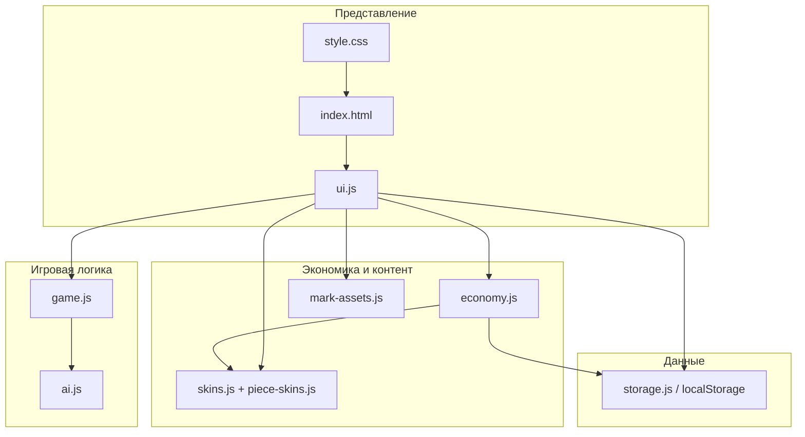
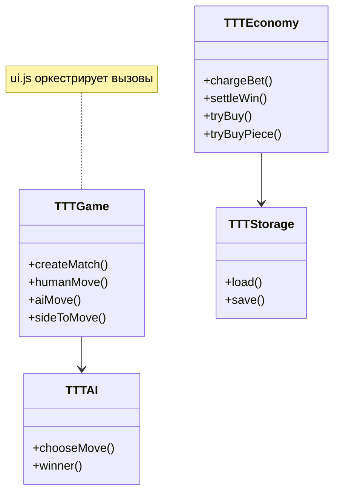

# Крестики-нолики (веб-игра)

Локальная игра в браузере: ставки, ежедневный бонус, магазин тем и скинов фишек, ИИ с тремя уровнями, редкий дроп с анимацией конфетти.

**Запуск:** открыть `index.html` в браузере.

---

## Минимальная UML-диаграмма

Ниже — упрощённая схема модулей и зависимостей.

---

## Какие ИИ-агенты использовались

| Инструмент / режим | Назначение |
|--------------------|------------|
| **Cursor — Agent mode** | Генерация и правки кода по запросу (HTML/CSS/JS, правки по всему проекту) |
| **Cursor — Ask mode** | Обсуждение system design, ответы без автоправок репозитория |
| **Cursor — встроенный чат** | Уточнения по коду |

Отдельные **subagent-исследователи** (Explore / Task) для этого проекта **не запускались** — структура проекта небольшая, контекст собирался прямыми чтениями файлов.

**Workflow:** типовой цикл «формулировка задачи в Agent → при необходимости уточнение в Ask → повтор до рабочего состояния» с пользовательскими правилами (выполнять команды в среде, не ограничиваться только инструкциями).

---

## Примеры промптов (3–5)

Ниже — характерные формулировки из процесса создания

1. **System design (начало):**  
   *«Нужно обсудить system-design для этой задачи:
    необходимо написать полноценную 2D игру крестики-нолики. требуемые функции:
    - завершение матча: победа, поражение, ничья
    - ощутимый результат победы: валюта, за которую в магазине можно купить скины (от стандартных дешевых до очень дорогих) и случайный дроп скинов раз в какую-то победу
    - для визуального оформления надо использовать бесплатные ассеты из открытых источников (предложи источники)»*

2. **Полная реализация:**  
   *«Напиши игру: локальная сессия, ставка 10, победа/поражение/ничья, старт 100 монет, +100 раз в день, дроп 1/1 000 000, ИИ easy/medium/hard.»*

3. **Скины и магазин:**  
   *«Сгенерируй скины для X и O, добавь в магазин, показывай превью, для крестика и нолика можно разные скины.»*

4. **Геймплей и вёрстка:**  
   *«Игрок случайно за X или O с равной вероятностью»*, *«магазин в три колонки, не длинный список»*, *«одинаковые размеры карточек»*, *«ячейки не должны менять размер при появлении символа»*.

5. **Эффект дропа:**  
   *«Вместо карт в салюте — конфетти.»*

Преднастроенного **отдельного пайплайна агента** (кастомный skill под этот репозиторий) **не подключалось** — использовались стандартные режимы Cursor и пользовательские правила из профиля.

---

## Что пришлось исправлять самостоятельно / точечно после генерации

- **Вёрстка магазина:** в `index.html` был **обрезан закрывающий тег** заголовка (`</h2` без `>`), из‑за этого ломался DOM и магазин растягивался на всю ширину — исправлен валидный `</h2>`. Также корректировались слишком подробные тексты о механиках игры
- **Поле 3×3:** без **`minmax(0, 1fr)`** у колонок/строк grid и **`min-width/min-height: 0`** у ячеек картинка фишки увеличивала минимальный размер дорожки — ячейки «прыгали» после хода.

---

## Структура проекта (кратко)

| Путь | Роль |
|------|------|
| `index.html` | Экраны: меню, игра, магазин, модалки |
| `css/style.css` | Темы `data-skin`, сетка магазина, доска, конфетти |
| `js/storage.js` | Сохранение в `localStorage` |
| `js/game.js` | Ходы, чей ход, итог с точки зрения игрока |
| `js/ai.js` | Лёгкий / средний / сложный (минимакс), символы ИИ/игрока параметризованы |
| `js/economy.js` | Ставки, ежедневка, покупки, дроп |
| `js/skins.js`, `piece-skins.js`, `mark-assets.js` | Каталоги и SVG data-URL |
| `js/ui.js` | События, отрисовка, магазин, конфетти при дропе |
